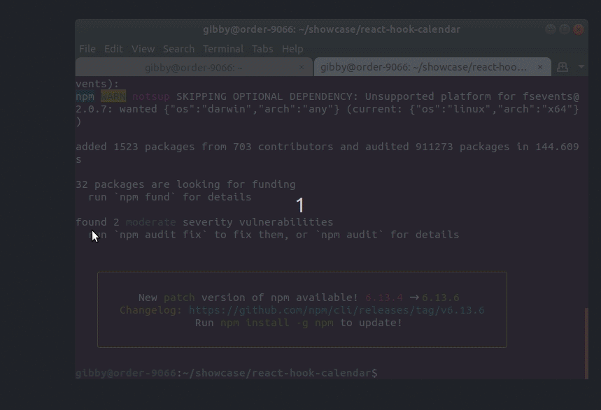

# React Calendar

This project was bootstrapped with [Create React App](https://github.com/facebook/create-react-app).

## Libraries Used
[Date-fns](https://date-fns.org/)

## Build Instruction

clone repository

```git
    git clone https://github.com/gibsonhan/react-hook-calendar
```

install dependencies
```
   npm install 
```

start application
```
    npm run start
```

Application Opens up on [http://localhost:3000](http://localhost:3000) to view it in the browser.

New Goal of this project
